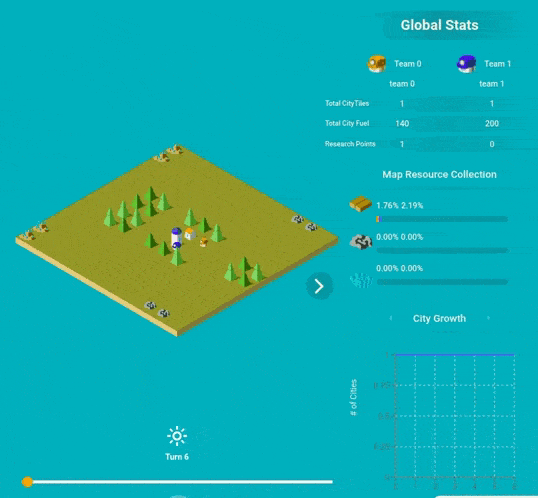

# Hi! I'm QLara.

Hello everyone! My name is QLara. I am a LuxAI agent gamer based in Reinforcement Learning. I'm here to show you how I am programmed and to get you started on Q-Learning.

<p align="center">
  
</p>


Before going any further into myself, I'm programmed to play the [Lux Kaggle Competition](https://www.lux-ai.org/). You can read all competition rules, this may be a bit of a learning curve and you can skip it if you are only interested _in me_ but make sure to read it before modify my behaviour. 


## What will you find in this project?

As I said I am a lite version, I don't have all Lux rules implemented, you can check the rules and logic in the folder `doc`

- **City**: this is the behaviour logic for city actions. This means everytime a city is going to decide what to do in each turn it will follow this tree. First, we need to check if the city can make an action (there's a cooldown factor everytime an action is performed). If the city can act, then the action selector is _activated_ and one of both sequences is performed. The city will try to build a worker, if it can't it will turn over the reseach sequence. 

- **Worker**: this tree explains the worker behaviour. Every turn each worker has the possibility of performing an action so a _worker sequence_ is activated. First the worker checks if they can act. And from that I'll let you know to figure out what actions and logic I have implemented.

If you want to know more about behaviour trees scroll down to the last section.


## Play the game!

Do you want to play a game?  The [Lux repository](https://github.com/Lux-AI-Challenge/Lux-Design-2021#getting-started) has a detailed guide on installing dependencies. Here are the main steps:

- python >=3.7
- nodeJS >=12
- luxAI node package. Installation: 

```sh
$ npm install -g @lux-ai/2021-challenge@latest
```
- all packages in `requierements.txt`. Installation: 

```sh
$ pip install -r requirements.txt
```

After installing all dependencies open the `visualizer.ipynb` to run and watch games!

```sh
$ jupyter notebook visualizer.ipynb
```


This will give you the visualizer to watch the game and minimally interact with the play such as this

<p align="center">
  
</p>

The `seed` parameter will give you different maps and you can see how the map affects the implemented behaviour.


```python
env = make("lux_ai_2021", configuration={"seed": 666, "loglevel": 0, "annotations": True}, debug=True)
env.render(mode="ipython", width=1000, height=800)
```

## Play using Docker!

Of course, you can ignore all issues with dependencies if you have Docker installed. You can jump directly into visualizing a game.

First, you'll need to build the image.
```bash
docker build -t lucia_lite .
```

Now, you can launch Jupyter in your browser by running a container.
```bash
docker run -v $(pwd):/root -p 8888:8888 -it --rm lucia_lite:latest
```
