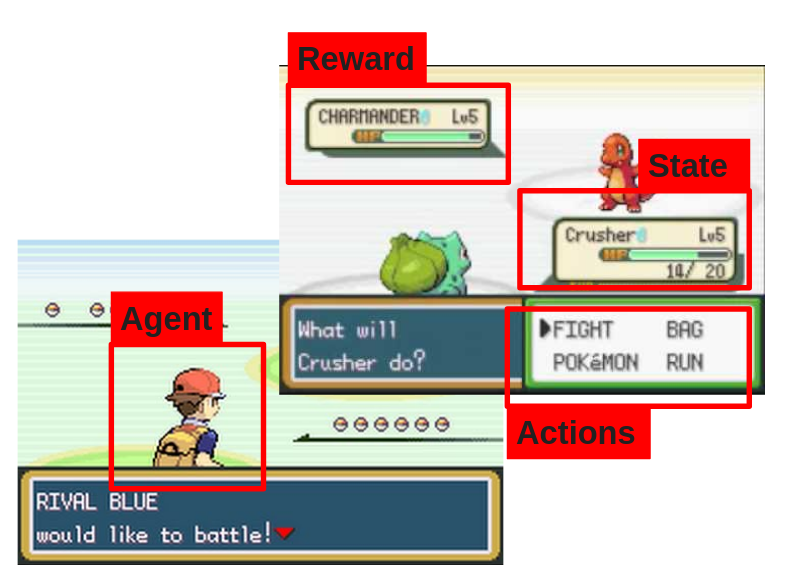
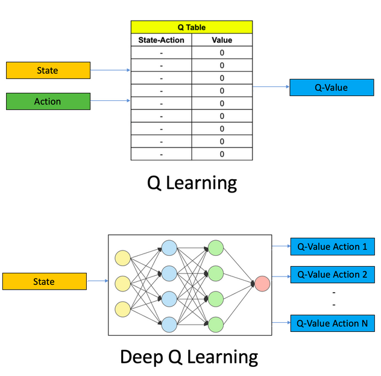
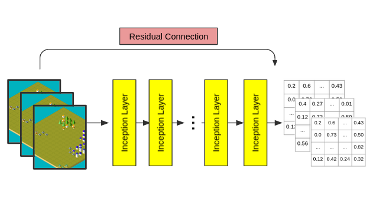
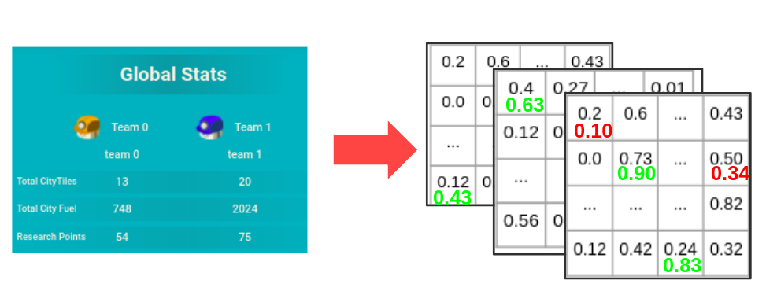
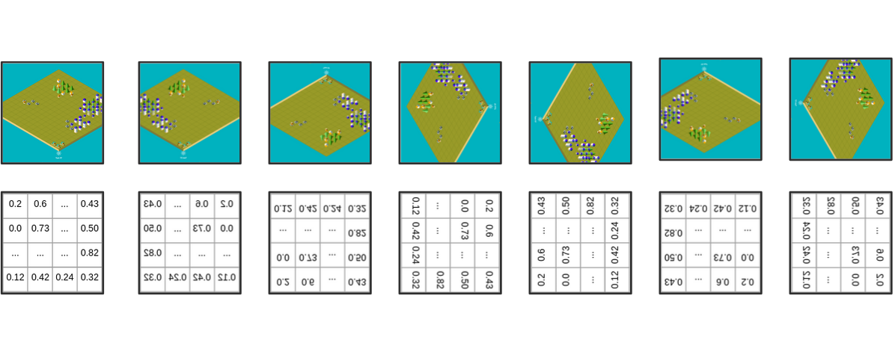

# What is Reinforcement Learning?

Reinforcement Learning is a kind of Machine Learning which is used when you do not have tagged data but you can evaluate, given an input (accion) in a certain state (environment), if the action is good or not (reward)

## What is Deep-Q-Learning?

There are many different algorithms of Reinforcement Learning. While some of them use a function to estimate the distribution of the probabilities of each function (policy) others just try to map an state with the best action (off-policy). Somo of this models are

* Actor-Critic
* Deterministic Policy Gradient
* Q-Learning

In particular, Q-Learning algorithm learns by computing the expected reward of an action given a certain state. For doing so the Q-Learning algorithm store a table called Q-table, which store the value of the expected reward given an state and and accion computed by the data from the learning process.

With the raise of Deep Learning, people has substitute the Q-table by a neuralnetwork that learngs given a state, which actions should be made using the reward as the loss functions. This variation of the original algorithm is called Deep-Q-Learning.

## How is QLara built?

QLara is an agent based in a Deep-Q-Learning algorithm to be used for the LuxAI challenge. She learn how to play by playing. QLara is a facade object which transform the game state (board and pieces) into a multidimensional matrix representation and pass it to the following three objects:

### Model

This object is a interface over a Keras model. The keras model is built through convolutional layers (Inception layers). This allows to treat the input state (matrix with the board information) as an image. It covolves over all the board channels (units, cities, resource,...) and return a matrix with the estimated confidence of each possible action in each board position. QLara use for each unit/city, the accion with the maximum probabilitie in its position.

### Reward

For the reward QLara uses the game reward, however, to allow learning estrategies and long term decisions, the reward of each action is stored in a memento which compute the rewards for a batch of actions/states, and not just one by one.

### Data Augmentor

Noting the number of possible game states as well as the board simmetries. This class is a Factory object of data. Given a batch of states and rewards. it computes all the possible transformations (rotation and flips) that keep the reward constant.

